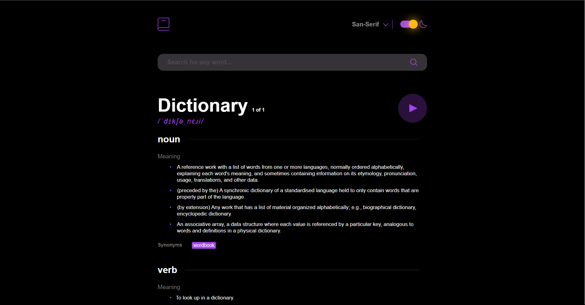

# Dictionary

[Live](https://dictionary-bad.netlify.app/)

Using the [Free Dictionary API](https://dictionaryapi.dev/), to create a simple dictionary site. This is me trying to remember how to make a basic website. been a while :(

Get word definitions syntax of a URL request to the API is: https://api.dictionaryapi.dev/api/v2/entries/en/word

## License

This project is licensed under the MIT License - see the `LICENSE` file for details.
